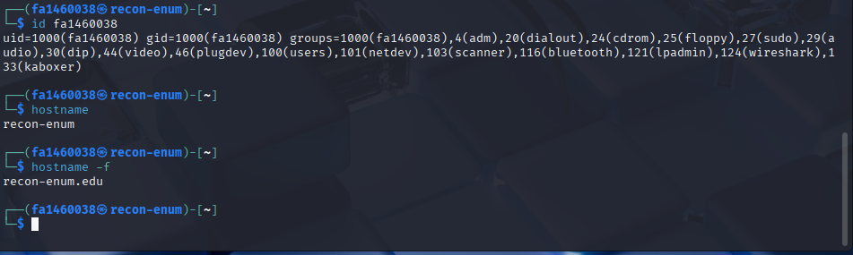

# Reconnaissance & Enumeration

## Description
This project demonstrates foundational reconnaissance and enumeration techniques performed in a controlled Kali Linux lab environment. The objective is to identify system configuration details, network information, and externally exposed services using standard Linux utilities and Nmap.

All activities were conducted ethically using permitted targets and a self-managed virtual machine.

---

## Key Objectives
- Configure and validate a Kali Linux virtual machine
- Identify local IP addressing and network configuration
- Perform external service and OS detection scans
- Interpret Nmap scan results
- Validate user, hostname, and domain configuration
- Document reconnaissance findings professionally

---

## Tools & Technologies
- Kali Linux
- Nmap
- Linux command-line utilities
- Proxmox Virtual Environment

---

## Environment
- Virtualization Platform: Proxmox
- Operating System: Kali Linux
- Hostname: recon-enum
- Domain: recon-enum.edu
- Network: Default Proxmox NAT configuration

---

## Lab Walkthrough

### 1. IP Address Identification
The first step was identifying the system’s assigned IP address to confirm network connectivity and interface configuration.

Command Used:
    ip addr show

Result:
- Identified active network interface (eth0)
- Confirmed assigned IPv4 address

---

### 2. Service & OS Detection Scan
An OS detection and service version scan was performed against a well-known external target to demonstrate enumeration without excessive probing.

Command Used:
    nmap -O -sV google.com

Findings:
- Target host reachable and responsive
- Ident service (TCP/113) reported as closed
- Common services such as HTTP and HTTPS identified
- Majority of ports filtered (expected behavior)

---

### 3. User & System Identification
System identity and permissions were validated to confirm correct user configuration.

Commands Used:
    id <username>
    hostname
    hostname -f

Results:
- Verified user ID and group memberships
- Confirmed hostname: recon-enum
- Confirmed fully qualified domain name: recon-enum.edu

---

## Key Findings Summary
- Kali Linux VM successfully deployed and configured
- Network connectivity confirmed via assigned IP address
- External enumeration performed safely and effectively
- Closed and filtered ports correctly identified
- System identity and domain configuration validated

---

## Defensive Security Takeaways
- Reconnaissance establishes foundational visibility for security analysis
- Even limited scans reveal valuable service and configuration data
- Understanding filtered vs. closed ports aids defensive interpretation
- Accurate system identification supports logging and incident response
- Enumeration is critical for both offense awareness and defense planning

---

## Skills Demonstrated
- Linux system administration fundamentals
- Network interface analysis
- Nmap service and OS detection
- Reconnaissance result interpretation
- Professional security documentation

---

## Ethical Notice
All actions were performed in accordance with course guidelines using authorized targets and self-managed lab environments. No unauthorized access or exploitation occurred.
